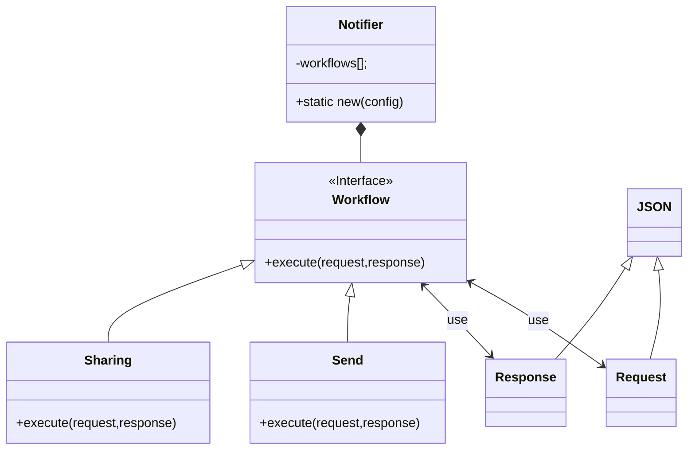

```mermaid
classDiagram
    Notifier *-- Workflow
    Workflow <--> Request: use
    Workflow <--> Response: use
    Workflow <|-- Send
    Workflow <|-- Sharing    
    JSON <|-- Request
    JSON <|-- Response
   
   class Notifier{
    -workflows[];   
    +static new(config)    
    }
    <<Interface>> Workflow
    class Workflow {        
        +execute(request,response)
    }

    class Send{
        +execute(request,response)
    }

    class Sharing{
        +execute(request,response)
    }

    class Request{

    }
    class Response{

    }
```