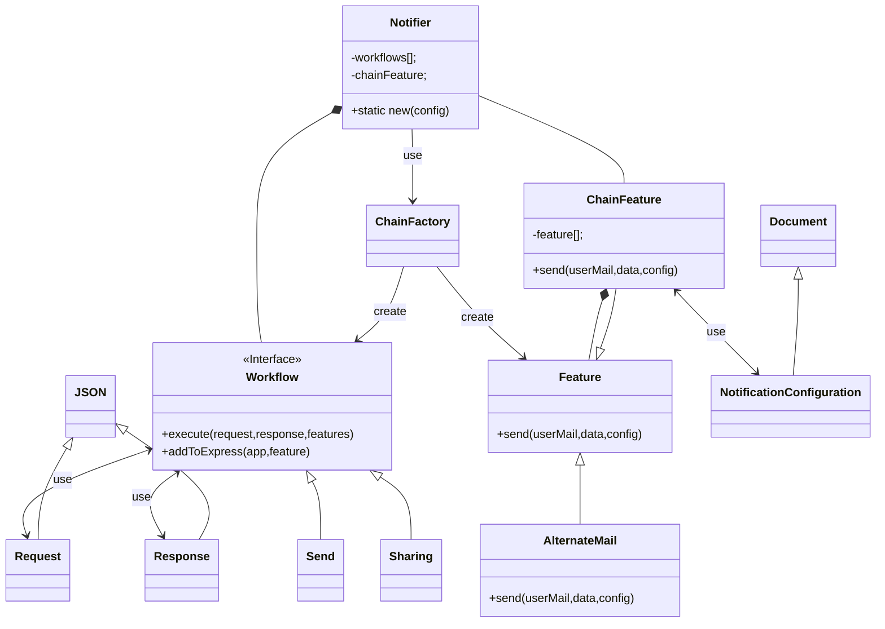

## Feature
it is a generic command pattern that aggregate multiple specific commands  
for example when you call send(userMail,template,data) internally we have to load the right UserSpecificCommand and call send(template,data)  
**Why userMail/userID/userMobile?** because technically we have to send a notification to one specific user no to a specific mail. in this case mail/ID/Mobile are nothing else than unique key of user
## AlternateMail
this is just a row of user specific dbase, is noSql dbase with just a specific json to describes the rules