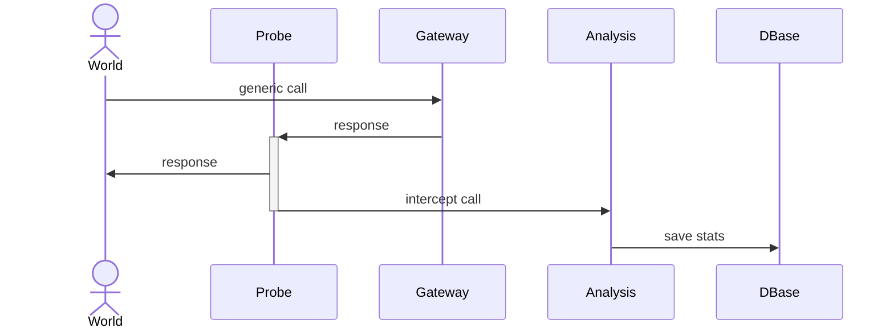
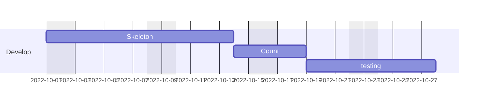
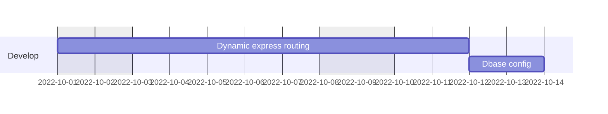

# probe services



# probe structure

## dbase
because probe configuration can change frequently, it is better to have a internal dbase to save the configuration instead the usual `config.js`
the default configuration is: no endpoint defined, just transparent  
with dbase configuration it will be possible to create a ui for that

## configuration
for example this is a configuration (stored in db) to spy the number of access to the poor massimiliano.regis@gmail.com
```
{     
intercept:{
    url:'POST /2021-08/auth/login',  
    email:"massimiliano.regis@gmail.com"
    },
analysis:[
    "Count"
    ]
}
```

this is a configuration to count the number of error during registration and send a notification after the number is >200
```
{     
intercept:{
    url:'POST /2021-08/auth/register',  
    errorCode:"*"
    },
analysis:[
    "Count",
    {
        "Notify":{
            to:"massimiliano.regis@gmail.com",
            template:"warning"
            after:200 
        }  
    }
]
```

## how analysis works?
it is a chain of responsability
when intercept is triggeres it will send the request/response and any next elaboration to any item  
analysis item is nothing else than a class (name is the key) and the object value is the constructor

# develop timing

## step one
- create a probe system that works over config.js without config dbase _(it is easier because similar on notification system)_
- create just a Count analysis


## step two
- move the configuration over an integrated dbase _(nedb is perfect for that)_


## step three to x
- add multimple Analysis item _(as a plugin)_

