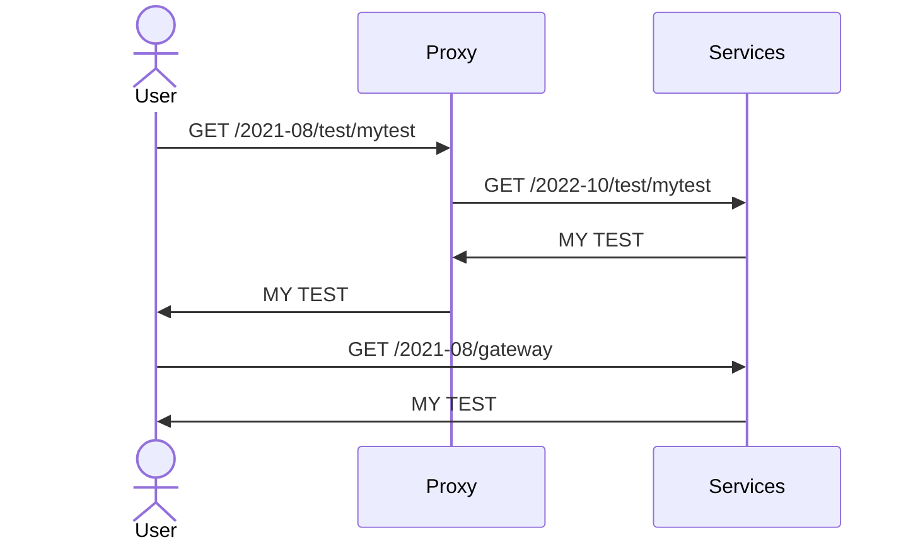

# Proxy
## Purpose
this service is really similar than a reverse proxy  
it is created to be fully configurable plugin based  
plugins are nothing else than specific classes with some specific role
Why it is needed:
- new 2022 SQL services: in this way we are able to redirect in a full transparent way all the traffic throw SQL without change nothing over the UI

## Configuration
```json
{
"/2021-08/proxy":{  
            "defaultClass":"Proxy",  
            "listen": {  

            }
        }
}
```

it is possible to create specific plugins and call them on this way  
in this case the plugin is 'IfHost'
```json
{
"/2021-08/proxy":{  
            "defaultClass":"Proxy",  
            "listen": {  
                "/2021-08/test":{
                    "cls": {"IfHost":"test.com"},
                    "redirect":"${gateway}/2022-10/test"                    
                }                
            }
        }
}
```


## Report sequence
the answer from proxy to user is completely transparent to user.  
In order to obtain a fast performance the proxy is require a restart if configuration change.


