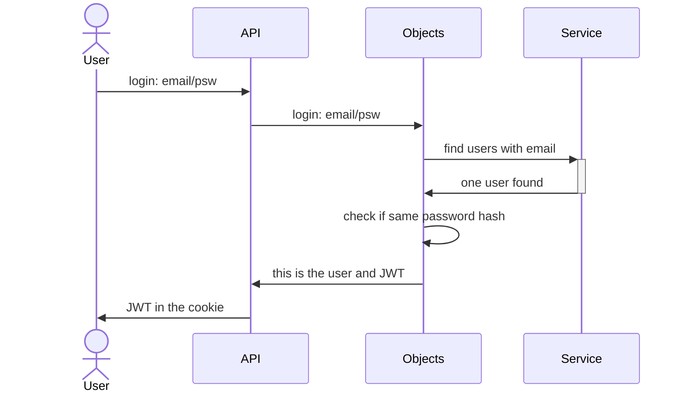

# authentication system
usually a jwt system is composed by:
- [authorization](authorization)
- [authentication](authentication)  
**this service is only the authentication layer**

# Login Diagram
API: account/index.js  
Objects: account/Authentication.js  
Service: 2022-10/user  




# jwt
jwt is a special token composed by three parts:
- header
- payload
- signature

[jwt official resources](https://jwt.io/)

jwt example:
``````

## header
it is a easy description of the token name and the cryto name
```
{
  "alg": "HS256",
  "typ": "JWT"
}
```
## payload
it is a generic json information *no sensitive data*
```
{
  "id": "bef08a66-9bf3-46de-983b-cb3d09c1a03d",
  "email": "",
  "roles": [
    {
      "name": "admin"
    },
    {
      "name": "4cd8d177-417f-476d-9f64-1d5efadec831:admin",
    }
  ],
  "iat": 1661871375
}
```
in this case the user info contains the email and the roles    
**it is super-important know that payload isn't encrypted**  
it is just base64 format


# authorization
Authorization is a middleware created in order to verify the jwt  
**this layer have to contain the private key**  
we have to send jwt in each server call in header or as a cookie  
## header
auth : {jwt}   
Authorization: bearer {jwt}  
## cookie
auth  

# authentication
this layer contains all the endpoint in order to authenticate the user  
[api docs](/2021-08/openApi/api-docs/#/Auth)
- register
- login
- change password
- reset password
- me

the *user/me* endpoint are able to read the jwt over header/cookie and response with a full complex data from dbase data

# client side
the client have to store the jwt in cookie or just send jwt in header in for each call  
it is possible to obtain a full data information about user with: */user/me* endpoint  
but in order to know if user is authenticated this isn't needed, just verify the presence of the jwt could be enough in the general case  
*/user/me* is important to 
- avoid hacking attack (try to force a jwt)
- have a full user data


